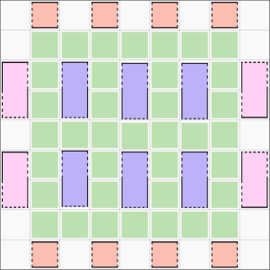

# The Lattice Surgery Scheduling Problem (LSSP)

The lattice surgery scheduling problem (LSSP) we wish to address is the problem of scheduling a circuit on a logical map, which is topology consisting of logical qubits, or patches, of which some are data, some are bus, some are magic state and some are ancillary. Figure 4b from the LSSP paper shows a topology that is easily parallelizable. The green patches are bus qubits, the blue patches are data qubits, the orange patches are magic state qubits and the pink patches are ancillary qubits.

The circuits are expressed as a set of Pauli rotation measurements with dependencies that form a DAG. Following the paper, we can assume the circuits are always transpiled, which reduces both the number of operations and the potential parallelism. The latter is bad but for the circuits looked at in the paper, the benefits of shorter circuits were always greater than the loss of parallelism. Transpilation removes all the PI/4 rotations by commuting them past the qubit measurements. This simplifies the problem because we are left with only PI/8 rotations, for which we require only magic state qubits, not ancillary qubits. So the pink patches in the figure can be replaced by orange or purple patches. Because of the transpilation, each operator can require multiple qubits, so we have to use a Steiner tree to connect the magic qubit to the required data qubits over the bus qubits, with no overlapping paths (i.e. bus qubits can only be used for one operator).

To quote the paper, "A Game of Surface Codes":

"Clifford+T circuits can be written in
terms of π/8 rotations, π/4 rotations and measurements. To convert input circuits into a standard form,
π/4 rotations can be commuted to the end of the circuit and absorbed by the final measurements. Thus, any
quantum computation can be written as a sequence of
π/8 rotations grouped into layers of mutually commuting rotations. The number of rotations is the T count
and the number of layers is the T depth. Each rotation
can be performed by consuming a magic state via a
Pauli product measurement. These measurements can
be implemented in our framework in 1."

